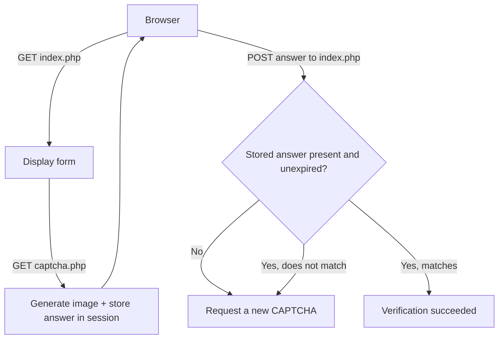

# CAPTCHA Generator (PHP)

A dependency-free PHP library that renders PNG CAPTCHA images with the GD extension and includes a session-backed example form.

`Captcha.php` generates the image. It does not handle HTTP sessions itself; the `examples/` directory shows one way to store, expire, and validate answers server-side.

## Features

- Random CAPTCHA text generated with `random_int()`.
- TrueType rendering with per-character font, angle, and position variation.
- Background rectangles, arc, and pixel noise.
- Stream a PNG response with `output()` or write a PNG file with `save()`.
- Session example with 5-minute expiry, single-use answers, and cache-prevention headers.
- No dependencies, framework, or build step.

## Requirements

- PHP 8.0 or newer.
- PHP GD extension with FreeType support.
- The bundled `fonts/Acme.ttf` and `fonts/Retro.ttf` files.

Check your installation:

```sh
php -v
php --ri gd
```

`php --ri gd` should report both `GD Support => enabled` and `FreeType Support => enabled`. The constructor throws a `RuntimeException` when GD or `imagettftext()` is unavailable, or when a bundled font is missing.

## Project structure

```text
Captcha.php          Image generation library; no session or HTTP form logic
examples/
  captcha.php        Creates a CAPTCHA image and stores the answer in the session
  index.php          Demo form that displays, refreshes, and validates the answer
fonts/
  Acme.ttf           Bundled rendering font
  Retro.ttf          Bundled rendering font
LICENSE              MIT License
```

There is no `composer.json`, test suite, CI workflow, deployment configuration, or environment-variable file. None is needed to use the library.

## Installation

Clone the repository:

```sh
git clone https://github.com/ariyx/CAPTCHA-Generator.git
cd CAPTCHA-Generator
```

No installation step follows. Include `Captcha.php` directly from your application:

```php
require '/path/to/CAPTCHA-Generator/Captcha.php';
```

Keep the `fonts/` directory alongside `Captcha.php`; its paths are resolved relative to the library file.

## Usage

### Stream a fixed-text CAPTCHA

Useful for debugging or reproducible output:

```php
require 'Captcha.php';

$captcha = new Captcha(null, null, 'HELLO');
$captcha->output();
```

`output()` must be called before any other output because it sends `Content-Type: image/png` and cache-prevention headers.

### Save a CAPTCHA to a file

```php
require 'Captcha.php';

$captcha = new Captcha(null, null, 'HELLO');
$captcha->save(__DIR__ . '/captcha.png');
```

`save()` throws a `RuntimeException` when the PNG cannot be written.

### Generate a random CAPTCHA

The default character set is `ABCDEFGHJKLMNPQRSTUVWXYZ23456789` and the default length is 5:

```php
require 'Captcha.php';

$captcha = new Captcha();
$captcha->output();
```

Use a custom character set and length:

```php
require 'Captcha.php';

$captcha = new Captcha('ABCDEFGHJKLMNPQRSTUVWXYZ', 6);
$captcha->output();
```

### Customize image dimensions and noise

```php
require 'Captcha.php';

$captcha = new Captcha(
    permittedChars: 'ABCDEFGHJKLMNPQRSTUVWXYZ23456789',
    stringLength: 5,
    text: null,
    width: 200,
    height: 60,
    fontSize: 22,
    noiseCount: 8
);
$captcha->output();
```

### Validate an answer server-side

Never expose `getText()` to the browser. Store it in a server-side session or datastore, then compare it when the form is submitted:

```php
$stored = $_SESSION['captcha_example']['answer'] ?? null;
$submitted = $_POST['captcha'] ?? '';

if (
    is_string($stored)
    && is_string($submitted)
    && hash_equals(strtoupper($stored), strtoupper(trim($submitted)))
) {
    // Correct.
}
```

The bundled example deletes the stored answer after every attempt, so each CAPTCHA can be used once.

## API reference

Constructor:

```php
new Captcha(
    ?string $permittedChars = null,
    ?int $stringLength = null,
    ?string $text = null,
    int $width = 150,
    int $height = 50,
    int $fontSize = 20,
    int $noiseCount = 6
)
```

| Parameter | Default | Behavior |
| --- | --- | --- |
| `$permittedChars` | `'ABCDEFGHJKLMNPQRSTUVWXYZ23456789'` | Characters used when `$text` is not supplied. Must not be empty. |
| `$stringLength` | `5` | Length of generated text. Must be greater than `0`. Ignored when `$text` is supplied. |
| `$text` | `null` | Fixed text to render. When supplied, its length determines the rendered length. |
| `$width` | `150` | Image width in pixels. |
| `$height` | `50` | Image height in pixels. |
| `$fontSize` | `20` | TrueType font size. |
| `$noiseCount` | `6` | Number of background rectangles. |

Methods:

| Method | Behavior |
| --- | --- |
| `getText(): string` | Returns the answer. Keep it server-side. |
| `output(): void` | Renders the image, sends PNG and no-cache headers, and frees the GD resource. |
| `save(string $path): void` | Renders the image to a PNG file. Throws `RuntimeException` on failure. |
| `generateCaptcha(): void` | Alias for `output()`. |

Invalid constructor input throws `InvalidArgumentException` for an empty character set or a non-positive length.

## Session example

Run the demo from the repository root:

```sh
php -S 127.0.0.1:8000
```

Then open:

```text
http://127.0.0.1:8000/examples/
```

How it works:

- `examples/captcha.php` creates a random CAPTCHA, stores its answer and a 5-minute expiry timestamp in `$_SESSION['captcha_example']`, releases the session lock, and streams the PNG.
- `examples/index.php` renders the form, refreshes the image with a cache-busting query string without reloading the page, and validates submissions case-insensitively.
- Every validation attempt deletes the stored answer. Success, failure, missing data, and expiry all require requesting a fresh image.
- The expected answer never appears in HTML or JavaScript.



## Local development

The project uses PHP's built-in web server for the example. There is no watcher, bundler, or separate frontend:

```sh
php -S 127.0.0.1:8000
```

Edit `Captcha.php` or the files in `examples/`, then reload the browser.

## Testing

This repository has no automated test suite.

At minimum, lint the changed files and exercise the example manually:

```sh
php -l Captcha.php
php -l examples/captcha.php
php -l examples/index.php
```

Manual verification:

1. Start the server with `php -S 127.0.0.1:8000`.
2. Open `http://127.0.0.1:8000/examples/`.
3. Confirm an image loads, refresh works, a correct entry succeeds, an incorrect entry fails, and reuse of the same image requires a refresh.

## Deployment notes

- Deploy on any PHP 8.0+ host with GD and FreeType enabled.
- Deploy `Captcha.php` together with the `fonts/` directory.
- Ensure PHP session storage is writable if you use the session pattern from `examples/`.
- Call `output()` before sending any other response body; otherwise the image will be corrupted by premature output.
- The example's cache-prevention headers are appropriate for CAPTCHA endpoints and should be preserved when adapting the code.
- There are no environment variables, secrets, migrations, or background workers.

## Troubleshooting

| Symptom | Likely cause and fix |
| --- | --- |
| `The GD extension is required.` | Install or enable PHP GD, then restart PHP/the web server. |
| `GD must have FreeType support enabled.` | Reinstall or re-enable GD with FreeType support; verify with `php --ri gd`. |
| `Captcha font not found` | Ensure `fonts/Acme.ttf` and `fonts/Retro.ttf` are deployed alongside `Captcha.php`. |
| Broken image or headers-already-sent warning | Ensure `output()` is called before any echo, whitespace, BOM, or error output. |
| `Could not save CAPTCHA` | Check that the destination directory exists and is writable. |
| Demo says the CAPTCHA expired or is unavailable | Request a new image; answers expire after 5 minutes and are consumed after every submit. |

## Security notes

- Store answers server-side and compare them with `hash_equals()`.
- Treat answers as single-use and short-lived, as the example does.
- Do not put the answer in HTML, JavaScript, URLs, cookies, or image metadata.
- This is a lightweight bot deterrent, not authentication or access control. High-value flows may need rate limiting or a stronger challenge.

## Contributing

Issues and pull requests are welcome. Keep changes focused, preserve the existing code style, and verify PHP files with `php -l` plus a manual run of the example.

## License

[MIT License](LICENSE)
